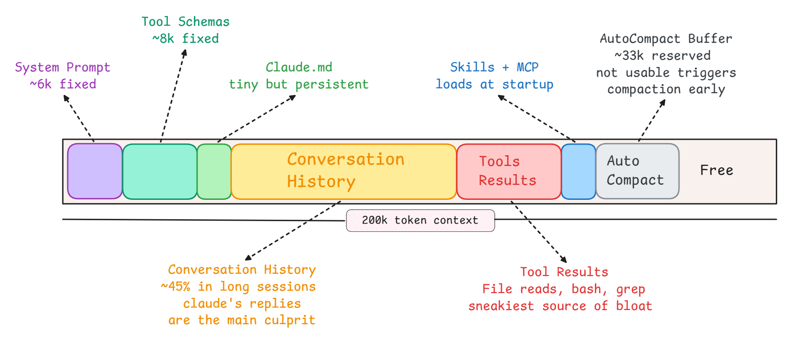
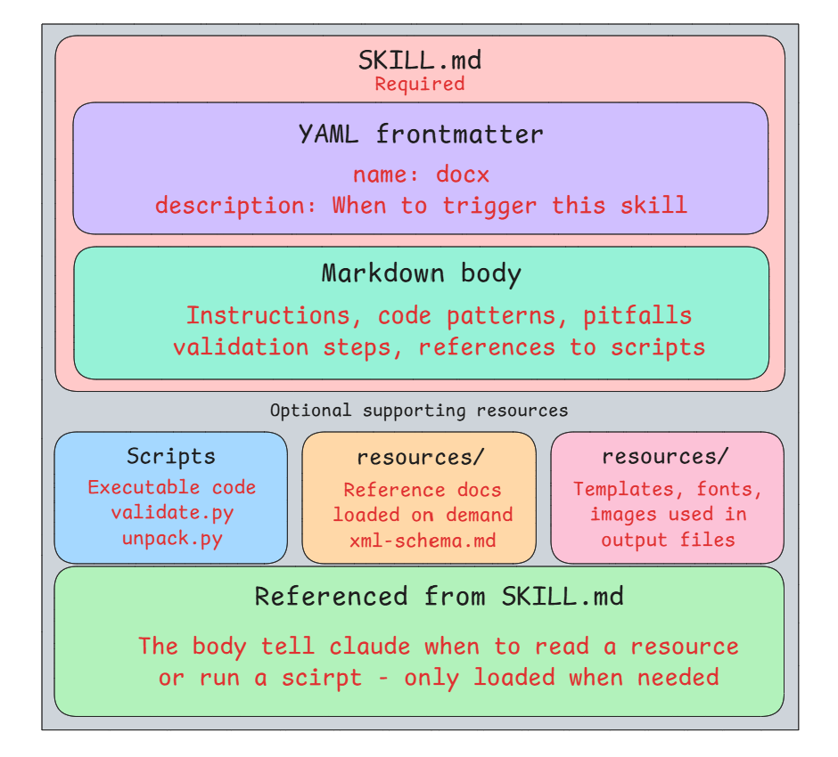
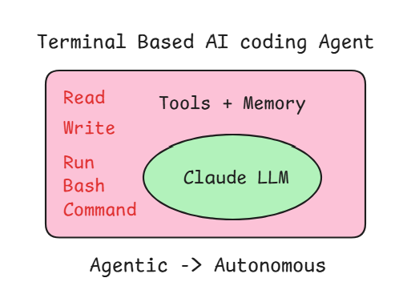
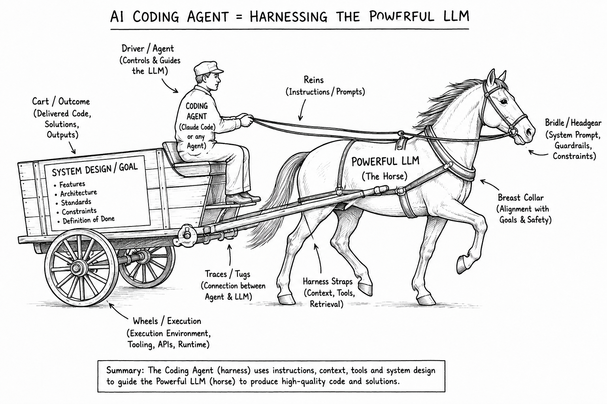
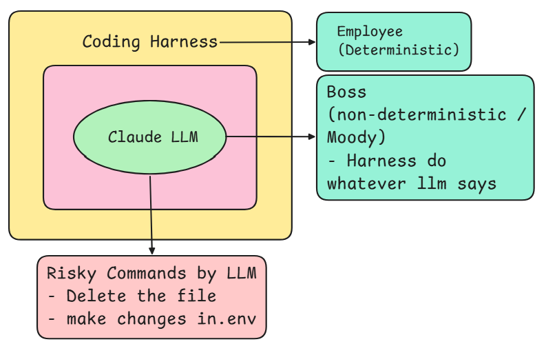
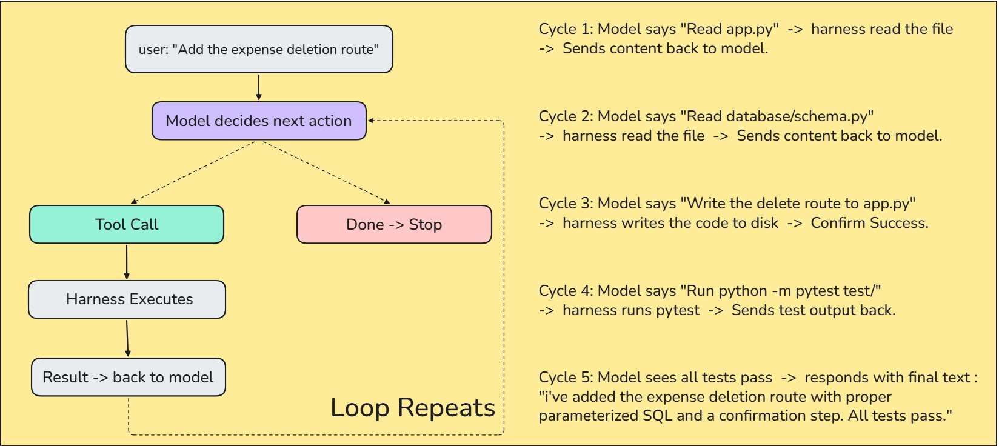
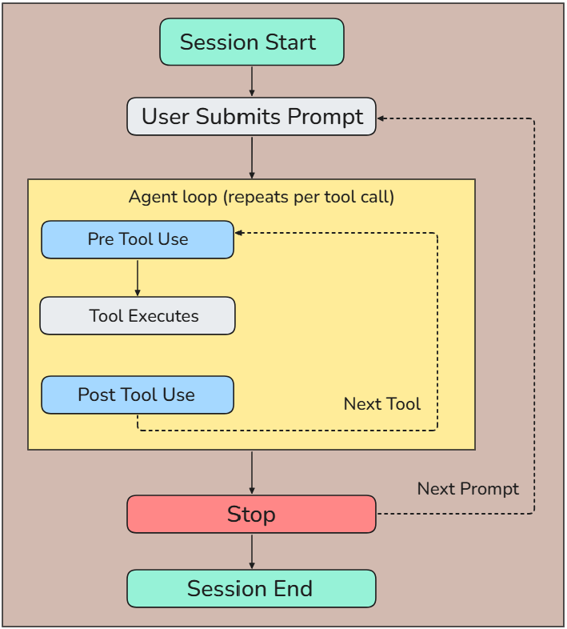
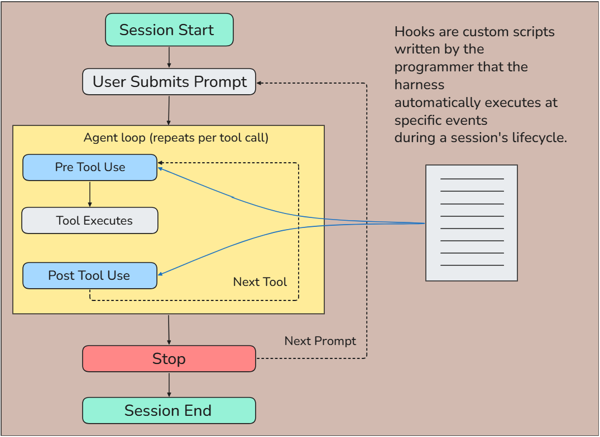

# Claude Code (CC) — Notes & Workflow

## 1. What Is Vibe Coding?

**Vibe coding** is an approach where you use AI heavily to build software by describing what you want in natural language and iterating on the generated code, rather than manually writing every part yourself.

### Where Vibe Coding Is Useful

Vibe coding is particularly helpful for:

- Building MVPs
- Exploring ideas quickly
- Hackathons
- Prototypes
- Proofs of concept
- Low-stakes projects
- Learning and experimentation

### Where Vibe Coding Can Fall Short

Vibe coding is generally less suitable for:

- Highly scalable systems
- Critical infrastructure
- Safety-critical systems
- Systems where correctness is extremely important
- Projects with significant financial consequences

> **Rule of thumb:** Vibe coding is great for moving fast when the cost of being wrong is low. As the cost of failure increases, you need stronger engineering discipline, review, testing, architecture, and human oversight.

---

# 2. Why Claude Code?

There are many AI coding tools, such as:

- Cursor
- Windsurf
- Codex
- GitHub Copilot
- Replit
- Lovable

But Claude Code (CC) stands out because of its ability to work directly with a codebase and operate as an agent.

## Why Use Claude Code?

### 1. Best Raw Coding Intelligence

Claude is strong at understanding programming problems and generating high-quality code.

### 2. Strong Long-Context Handling

It can work with large amounts of code and project context without losing track of the bigger picture.

### 3. Better Refactoring & Architecture

Claude Code is particularly useful when you need to:

- Understand existing code
- Refactor large sections
- Improve architecture
- Trace dependencies
- Make changes across multiple files

### 4. Agentic Capabilities

Claude Code can interact with the project rather than simply generating snippets.

It can:

- Read files
- Search the codebase
- Modify files
- Run commands
- Run tests
- Inspect errors
- Iterate on implementations

### 5. It Behaves More Like a Senior Engineer

Instead of treating every request as an isolated coding task, CC can reason about the broader project, its architecture, dependencies, and trade-offs.

---

# 3. Starting With a Half-Done Project

Whenever you receive or inherit a half-finished project, don't immediately start changing code.

Start by asking Claude Code these three questions:

### Question 1

> What does this project do?

### Question 2

> What tech stack does this project use?

### Question 3

> Explain the project structure to me.

These questions help you establish:

- The purpose of the project
- The technologies being used
- The overall architecture
- The important directories and files
- Where the main logic lives
- Where to start making changes

---

# 4. Slash Commands

**Slash commands** are shortcuts you type inside a Claude Code session.

They start with `/` and trigger a predefined action or workflow without requiring you to write a full prompt.

## Types of Slash Commands

### Built-in Commands

# Claude Code Slash Commands — Quick Reference

| Command | What it does | When to use it |
|---|---|---|
| `/resume` | Resumes or switches to another Claude Code session. | When you want to continue working on a different session. |
| `/rename [name]` | Renames the current session. | Use it at the start to give your session a meaningful name. |
| `/btw [question]` | Asks a quick side question without adding it to the main session history. | Use it for unrelated questions or quick clarifications. |
| `/export` | Exports the current session's chat history to your directory. | Useful before a big refactor or when you want to save the conversation. |
| `/models` | Lets you select or switch the Claude model. | Use it to switch between Opus, Sonnet, and Haiku. |
| `/usage` | Shows your current Claude Code usage. | Use it to check how much usage you have consumed. |
| `/extra-usage` | Enables additional usage after reaching your normal usage limit. | Use it when you hit your usage limit and need to continue. |
| `/stats` | Shows Claude Code usage statistics. | Use it to review your usage and activity. |
| `/insights` | Shows insights about your Claude Code usage. | Use it to understand your usage patterns. |
| `/config` | Opens Claude Code configuration/settings. | Use it when you want to change Claude Code settings. |
| `/permissions` | Manages Claude Code permissions. | Use it to control what Claude Code is allowed to do. |
| `/login` | Logs you into your Claude account. | Use it when authentication is required. |
| `/logout` | Logs you out of your Claude account. | Use it when you want to sign out. |
| `/theme` | Changes the Claude Code terminal theme. | Use it to customize the terminal appearance. |
| `/voice` | Enables or disables voice mode. | Use it when you want to interact with Claude Code using voice. |
| `/rewind` | Go back in chat or Code edits done by claude | Use it when you want to go back and undo the code edits done by claude. |

## 🧠 Easy Way to Remember

| Category | Commands | Purpose |
|---|---|---|
| **Sessions** | `/resume` `/rename` `/btw` `/export` | Manage your conversations and session history |
| **Models** | `/models` | Choose which Claude model to use |
| **Usage** | `/usage` `/extra-usage` `/stats` `/insights` | Monitor and understand your usage |
| **Settings** | `/config` `/permissions` | Control Claude Code behavior and access |
| **Account** | `/login` `/logout` | Manage your Claude account |
| **Interface** | `/theme` `/voice` | Customize how you interact with Claude Code |


# 5. Sessions in Claude Code

A **session** is one conversation with Claude Code.

It Starts when you run:

```bash
claude
```
---
- if you want to give a bash commands in the claude terminal then use ! in front of it
for ex: for the bash commands
!git add .

for ex: claude slash commands
/resume or /login 

- keep commiting as the checkpoints don't forget
- we can add the @ befroe the file name to mention the file in claude prompt
- we can pass the image to claude to get the same ui given with proper prompt as well with image
- Tips to prompt claude
1. write your prompt in own words then use othere ai like chat gpt or what ever then polish it and use the prompt on claude and keep one notepad will all your prompt
---

## Bash Commands
Use an exclamation mark (`!`) before a command to execute bash instructions directly in the Claude terminal.

```bash
!git add .
```
### You can use @ before a file name to reference or mention a specific file in your Claude prompt.

``` Ex: @src/main.py ```

## Recommended Workflow

```
Write requirement
      ↓
Polish the prompt using AI
      ↓
Review the polished prompt
      ↓
Give the prompt to Claude
      ↓
Review Claude's changes
      ↓
Test the implementation
      ↓
Commit as a checkpoint
      ↓
Save useful prompt in your prompt library
```

---
# Claude Code — Context Window

## What Is a Context Window?

A **context window** is the amount of information, measured in **tokens**, that a model like Claude Code can see and use at one time while generating a response.

Think of it as the model's **working memory**.



### Key Points

- Claude Code has a context window of approximately **200K tokens**.
- Each new session starts with a **fresh context window**.
- Tokens are consumed by both:
  - User messages
  - Claude Code's responses
- Claude's replies can consume roughly **6× more tokens** than user messages.
- Every request sends the **entire conversation history** from scratch.
- Sub-agents get their own **isolated context window**, completely separate from the main session.
- Sub-agents return only a **summary** to the main context, not their full working history.

---

# Why Does the Context Window Matter?

The context window is important because:

- It affects **cost**.
- It determines how you should **structure your workflow**.
- Response quality can **degrade as the context fills up**.

---

# What Happens When the Context Window Fills Up?

The context window typically goes through several stages as it becomes full:

### Stage 1 — Quality Degrades

As more information fills the context window, the model may have more difficulty maintaining focus and producing high-quality responses.

### Stage 2 — Auto-Compaction

When the context reaches approximately **75–92% capacity**, automatic compaction may be triggered.

### Stage 3 — Repeated Compaction

Repeated compaction can potentially lead to loss of important context or inconsistencies.

### Stage 4 — Hard Stop

Eventually, the context window reaches its limit and the session can no longer continue normally without reducing or resetting the context.

---

## Solutions for Managing Context

- Use `/compact` to reduce and summarize the current context.
- Start a **sub-agent** for the next isolated or independent task.
- Use `/clear` or start a **new session** when the current context becomes too large or cluttered.

---

## Good Practices

- **One session per feature** — keep each session focused on a single feature or task.
- **Use `/compact` proactively, not reactively** — compact the context before it becomes too large.
- **Write focused, specific prompts** — avoid unnecessary information.
- **Use sub-agents for isolated or exploratory work** — keep the main session's context clean.
- **Use `.claudeignore`** — exclude irrelevant files from Claude Code's context.

## Recommended Workflow

```
Start a session
      ↓
Focus on ONE feature
      ↓
Write focused prompts
      ↓
Use sub-agents for isolated tasks
      ↓
Monitor context usage
      ↓
Use /compact proactively
      ↓
Complete the feature
      ↓
Commit changes
      ↓
Start a new session for the next feature
```

---

# CLAUDE.md

## Why CLAUDE.md?

LLMs do not have persistent memory across sessions.

Claude Code cannot remember project-specific instructions from previous sessions, so without a persistent instruction file, you may need to repeat the same instructions every time.

This can lead to:

1. Repeating instructions across sessions.
2. Repetition becoming cumbersome and error-prone.
3. Inconsistent code generation.
4. Claude not consistently following project-specific conventions.

---

## What Is CLAUDE.md?

`CLAUDE.md` is a special **project-level instruction file** used by Claude Code to guide how it behaves while working on your codebase.

Think of it as a **persistent system prompt for your project**.

---

## What Should Go Into CLAUDE.md?

Instead of repeatedly telling Claude:

- How your project is structured.
- Which coding conventions to follow.
- How to run, build, and test the project.
- Which tools and libraries to use.

You can put these instructions inside and Claude automatically uses it as context every time:

```text
CLAUDE.md
```

---
# Creating `CLAUDE.md`

## Creation Methods
* **Manually**
* **Automated:** Using `/init`

---

## Why Use `/init`?

### When `/init` Helps
* **Onboarding an existing codebase you didn't code:** Faster than reading everything yourself.
* **Large repos with many files:** Claude can spot patterns you might forget to document.
* **New to `CLAUDE.md`:** Good way to see what the formatting looks like.
* **Quick Prototypes:** Saves time when you don't want to invest heavily in writing docs upfront.

---

## How `/init` Works

1. **Triggers an internal agent** that takes over the scanning and writing task.
2. **Scans high-signal config files first:** `package.json`, `requirements.txt`, `Makefile`, `README.md`.
3. **Reads directory tree structure.**
4. **Infers details:** Tech stack, folder layout, and naming conventions.
5. **Generates `CLAUDE.md`:** Writes the file directly to the project root with the inferred context.

---

## `CLAUDE.md` Utility Split

* **Generated Content (~30%):** Basic setup and auto-detected context.
* **Manual Content (~70%):** Workflows, constraints, what to avoid, deployment targets, and explicit naming conventions (must be written manually).
---

# Structure & Sections of `CLAUDE.md`

## 1. Project Context
A short description of the project so Claude immediately understands what it is building or modifying.

> **Example:**
> This is a FastAPI backend for a health-tracking application that stores patient BMI records and exposes CRUD APIs.

---

## 2. Architecture
Explains how the codebase is structured and where things belong.

> **Example:**
> * Routes live in: `routers/`
> * Business logic lives in: `services/`
> * Schemas live in: `schemas/`
> * Persistence logic lives in: `repository/`

---

## 3. Code Style
Tells Claude how code should look and what conventions to follow.

> **Example:**
> * Use Python type hints everywhere.
> * Prefer Pydantic models for request and response schemas.
> * Keep functions small and focused.

---

## 4. Preferred Libraries
Constrains what tools and frameworks should be used.

> **Example:**
> * Use **FastAPI** for APIs.
> * Use **Pydantic** for validation.
> * Use **SQLAlchemy** for ORM.
> * *Do not introduce new dependencies unless necessary.*

---

## 5. Commands
Lists exact commands for running, testing, and maintaining the project.

> **Example:**
> * **Install dependencies:** `pip install -r requirements.txt`
> * **Run dev server:** `uvicorn main:app --reload`
> * **Run tests:** `pytest`

---

## 6. Critical Rules
Highlights critical warnings, edge cases, and things to avoid.

> **Example:**
> * Do **not** modify `database.py` unless absolutely necessary.
> * Patient IDs are provided by the client; **do not** auto-generate UUIDs.
---
---

# `.claude` Folder Configuration

The `.claude` folder is Claude Code's configuration directory that controls how Claude behaves—either for a specific project or globally across all projects on your machine.

It stores configuration information including skills, custom slash commands, sub-agents, and settings.

---

## Configuration Levels

* **Project-Level (`<project-root>/.claude/`):** Scoped to a single project, committed to the repository, and shared across the team.
* **Global / User-Level (`~/.claude/`):** Scoped to your local machine, applies to every project, and remains personal to you.

---

## Project-Level vs. Global Comparison

| Feature | Project-Level | Global / User-Level |
| :--- | :--- | :--- |
| **Location** | `<project-root>/.claude/` | `~/.claude/` |
| **Scope** | This project only | Every project on your machine |
| **Shared with Team** | **Yes** (lives in the repo) | **No** (only on your machine) |
| **Use Case** | Project-specific commands, workflows, settings | Personal commands you want available everywhere |

---
# `CLAUDE.md` Naming Conventions & Rules

## Exact Filename Requirement
The primary memory file for Claude Code **must** be named in full uppercase:

* **Correct:** `CLAUDE.md`
* **Incorrect:** `claude.md`, `Claude.md`, `Claude.MD`

*Note: On case-sensitive filesystems (Linux/macOS), using lowercase will cause Claude Code to fail to recognize and automatically load the file into memory.*

---

## Supported Locations

| Scope | Path | Shared with Team? |
| :--- | :--- | :--- |
| **Project Root** | `./CLAUDE.md` | Yes (committed to Git) |
| **Project Config** | `.claude/CLAUDE.md` | Yes (committed to Git) |
| **User Global** | `~/.claude/CLAUDE.md` | No (local machine only) |
| **Subdirectory** | `./some/folder/CLAUDE.md` | Yes (committed to Git) |

---

### Location Breakdown

* **User Global (`~/.claude/CLAUDE.md`):**
  Contains your personal preferences that apply across all projects (e.g., coding style defaults, preferred tools, or general working style). This user-level file is available across all your projects on your machine.

* **Subdirectory (`./some/folder/CLAUDE.md`):**
  Starting in the current working directory, Claude Code recurses up to the root (`/`) and reads any `CLAUDE.md` or `CLAUDE.local.md` files it finds. This is especially convenient in large repositories with sub-packages or sub-modules.

---

## Special Variant Files

* **`CLAUDE.local.md`:** 
  Used alongside `CLAUDE.md` for personal project overrides. Create `CLAUDE.local.md` in your project root. Claude reads it alongside the main `CLAUDE.md`, and it is automatically gitignored so your personal tweaks never land in the shared repo.

---

## Good Practices

- Start with `/init`, then modify your `CLAUDE.md` along with the project.
- Commit the `CLAUDE.md` to git.
- Only put universally applicable things in it.
- Use emphasis sparingly for critical rules (add the word **IMPORTANT** to make an instruction stand out).
  - Remember: if everything is IMPORTANT, nothing is.
- Keep it short — under 200 lines/instructions.
  - As instruction count increases, instruction-following quality decreases uniformly.
  - **Rule:** Ask of your instructions — "Would removing this cause Claude to make mistakes?" If not, cut it.

### If CLAUDE.md is getting bigger, split into rule files:  .claude/rules/files

```
project-root/
└── .claude/
    └── rules/
        ├── code-style.md
        ├── testing.md
        ├── security.md
        └── api-conventions.md
```

- Use `@imports` to reference external docs in CLAUDE.md:

```
<!-- CLAUDE.md -->

## API Conventions
see @docs/api-guidelines.md   <!-- 👈 @import used here -->

## Git Workflow
see @docs/contributing.md     <!-- 👈 @import used here -->
```

- Or use subdirectory CLAUDE.md files.

### Maintenance

- Treat your CLAUDE.md like a living document. Build it organically, not upfront.
- **Correct once, then codify** — if Claude makes the same mistake every time, ask it to keep that info in CLAUDE.md.
- Audit periodically — watch for instruction drift.

---

# Auto Memory

### Auto memory is a persistent directory where Claude records learnings, patterns, and insights as it works.
- It's a Markdown file (`.md`).

 **Example:** When Claude discovers something about your project (e.g., "oh, this application uses INR instead of USD"), it saves that to auto-memory. Next session, it already knows — no more repeating yourself.

### Location

```
~/.claude/projects/<project>/memory/:
```

- Only the first 200 lines of `MEMORY.md` load automatically.
- To review or edit what Claude has saved, run `/memory` during any session.

### Running `/memory`

Running `/memory` gives you 3 options:

1. **Project Memory**
   checked in at `./CLAUDE.md`
2. **User Memory**
   checked in at `~/.claude/CLAUDE.md`
3. **Open auto-memory folder**
   This opens the `MEMORY.md` file (created by Claude).

### Creating Memory Manually

To create memory from the user side, you can ask Claude to do it:

```
> update your memory files - we use INR instead of USD
```

---
# Spec-Driven Development in Claude Code

## The Problem: "Vibe Coding"

### What is Vibe Coding?
A modern style of programming where, instead of carefully planning everything upfront, you build software by interacting with an AI assistant in a fast, conversational, and experimental way.

---

## Core Issue: Loss of Control

When prompts are vague or underspecified, the AI is forced to make fundamental design and architecture decisions for you.

### Example Scenario
> **Prompt:** *"Build me a user auth system"*

Without clear constraints, critical technical decisions remain unspecified:

* **Which Framework?**
* **Authentication Strategy:** JWT or session-based?
* **Business Logic:** What are the password complexity rules?
* **Edge Cases & Security:** What happens after 3 failed login attempts?

---

## The Outcome

* You get code fast, but **it may not be the right code**.
* You end up trapped in an endless loop of **manual corrections and quick patches**.

---

# Spec-Driven Development (SDD)

## What is Spec-Driven Development?

Spec-Driven Development (SDD) is a software development approach where a detailed specification document is written **before** any code is written.

The Spec acts as the **single source of truth** for what the system should do, and all development flows directly from it.

---

## SDD Workflow

```text
Spec (What & Why)
   │
   ▼
Review
   │
   ▼
Design (How)
   │
   ▼
Review
   │
   ▼
Tasks
   │
   ▼
Build
   │
   ▼
Validate
```

# Spec-Driven Development (SDD) Detailed Workflow Breakdown

## Phase 1: Specification (`What` & `Why`)
*Focuses purely on the problem, business goals, and user requirements without tying them to a specific technical implementation.*

### Core Components
* **Problem Statement:** Clear description of the user pain point or business need being addressed.
* **Functional Requirements:** High-level behaviors and features the system must exhibit.
* **API Contracts:** Defined inputs, expected outputs, payload data shapes, and status codes.
* **Constraints:** Business rules, compliance requirements, or performance boundaries.
* **Edge Cases & Error Handling:** Anticipated failure points and expected graceful degradation.
* **Acceptance Criteria:** Unambiguous criteria that define when a feature is complete and correct.

---

## Phase 2: Spec Review
*Ensures all stakeholders agree on the problem definition and functional expectations before technical resources are allocated.*

### Key Objectives
* Validate that functional requirements solve the underlying problem statement.
* Confirm acceptance criteria are testable and complete.
* Resolve ambiguities before technical design begins.

---

## Phase 3: Technical Design (`How`)
*Translates the specification into concrete engineering choices and system architecture.*

### Core Components
* **Objective:** Technical summary of the system or feature being built.
* **Tech Stack:** Selected languages, frameworks, libraries, and tools.
* **Architecture:** System diagrams, component boundaries, and data-flow patterns.
* **Data Model:** Database schema definitions, entity relationships, and migrations.
* **Design Decisions:** Trade-offs evaluated and rationale behind technical choices.
* **Functional Flows:** Sequence diagrams or step-by-step logic paths for complex operations.
* **Development Plan:** High-level execution strategy and staging steps.

> **Strategic Advantage:** Separating the **Spec** from the **Design** isolates product intent from technical implementation. This allows you to change technologies or frameworks down the road without altering business logic or user requirements.

---

## Phase 4: Design Review
*Cross-functional technical review to catch architectural flaws and ensure system scalability.*

### Key Objectives
* Ensure security, performance, and data integrity standards are met.
* Confirm the design fully addresses every requirement listed in the Spec document.
* Finalize technical consensus across engineering team members.

---

## Phase 5: Task Breakdown
*Deconstructs the technical design into granular, actionable engineering tasks.*

### Example Component Tasks
* **Database & Models:** Migration scripts, schema definitions, and seed data.
* **Backend:** API endpoints, middleware, business logic modules, and unit test suites.
* **Frontend:** UI components, state management, routing, and form validations.
* **Integration:** Connecting client and server modules, end-to-end integration tests.

---

## Phase 6: Build
*Executing code development incrementally, task by task.*

### Guidelines
* Implement code following the guidelines and boundaries set in the Design document.
* Write automated unit and integration tests alongside functional code.
* Address tasks sequentially to maintain clean version control history.

---

## Phase 7: Feature Validation
*Verifying the built software against the initial specification.*

### Key Objectives
* Audit final deliverables against the **Acceptance Criteria** established in Phase 1.
* Perform edge-case verification and error-handling tests.
* Ensure no regressions or unapproved deviations from the initial Spec occurred.

---
# Spec-Driven Development Example: Chat Sidebar Feature

---

## Phase 1: Specification (`What` & `Why`)

### Problem Statement
Users need a way to view, organize, and access their past conversations within the chat application so they can seamlessly switch context or resume previous discussions in their active session.

### Functional Requirements
* Display a collapsible vertical sidebar on the left side of the main chat interface.
* Render a chronologically sorted list of all past chat sessions (newest first).
* Truncate long chat titles with an ellipsis (`...`) to keep the layout clean.
* Show visual active state styling on the currently selected chat item.
* Update the main window content to display the selected conversation when a user clicks a chat item.

### API Contracts
* **Endpoint:** `GET /api/v1/chats`
  * **Response Payload:**
    ```json
    {
      "chats": [
        {
          "id": "chat_8f9a2b",
          "title": "FastAPI Setup Discussion",
          "updated_at": "2026-08-11T14:30:00Z"
        }
      ]
    }
    ```
* **Endpoint:** `GET /api/v1/chats/:chat_id/messages`
  * **Response Payload:**
    ```json
    {
      "chat_id": "chat_8f9a2b",
      "messages": [
        {
          "id": "msg_01",
          "role": "user",
          "content": "How do I setup FastAPI?",
          "timestamp": "2026-08-11T14:28:00Z"
        }
      ]
    }
    ```

### Constraints
* Sidebar width fixed at `260px` on desktop layouts.
* Maximum of 50 chat history items fetched per page.

### Edge Cases & Error Handling
* **No history found:** Display an empty state reading *"No previous chats yet"*.
* **Network failure:** Show a retry button with a toast notification *"Failed to load chat history"*.
* **Deleted session:** If a user selects a deleted chat, show a 404 message in the main panel and remove it from the sidebar list.

### Acceptance Criteria
* [ ] Clicking any item in the sidebar loads that conversation's messages in the active window.
* [ ] The currently open chat is visually highlighted in the sidebar list.
* [ ] The history list loads in under 300ms on initial application open.

---

## Phase 2: Spec Review

### Key Objectives
* Confirmed that updating active sessions in-place (without full page reloads) satisfies product usability requirements.
* Validated that fetching conversation message history on-demand keeps initial page loads lightweight.

---

## Phase 3: Technical Design (`How`)

### Objective
Implement a responsive Chat Sidebar UI component connected to state management that streams conversation details into the main view upon interaction.

### Tech Stack
* **Frontend:** React, Tailwind CSS, Zustand (State Management)
* **Backend:** FastAPI, PostgreSQL, SQLAlchemy
* **API Client:** Axios

### Data Model (`chats` table schema)
```sql
CREATE TABLE chats (
    id VARCHAR(36) PRIMARY KEY,
    user_id VARCHAR(36) NOT NULL,
    title VARCHAR(255) NOT NULL,
    created_at TIMESTAMP WITH TIME ZONE DEFAULT CURRENT_TIMESTAMP,
    updated_at TIMESTAMP WITH TIME ZONE DEFAULT CURRENT_TIMESTAMP
);
```

### Architecture & Component Structure
```
src/
├── components/
│   ├── sidebar/
│   │   ├── SidebarContainer.tsx
│   │   ├── ChatHistoryList.tsx
│   │   └── ChatHistoryItem.tsx
│   └── chat/
│       └── ChatWindow.tsx
├── store/
│   └── useChatStore.ts
└── services/
    └── chatApi.ts
```

## Phase 4: Design Review

### Key Objectives
* Verified that updating Zustand global store state cleanly syncs active chat IDs across `SidebarContainer` and `ChatWindow`.
* Confirmed database indexes exist on `(user_id, updated_at DESC)` for fast queries.

---

## Phase 5: Task Breakdown

### 1. Database & Backend (FastAPI)
* [ ] Add `GET /api/v1/chats` route sorted by `updated_at DESC`.
* [ ] Add `GET /api/v1/chats/{chat_id}/messages` endpoint.
* [ ] Add automated endpoint integration tests using `pytest`.

### 2. Frontend State & API Integration
* [ ] Define TypeScript interfaces for `ChatSession` and `ChatMessage`.
* [ ] Create `useChatStore` in Zustand to manage `activeChatId`, `chatList`, and `messages`.
* [ ] Implement `fetchChats` and `selectChat` actions inside the store.

### 3. Frontend UI Components
* [ ] Build `SidebarContainer.tsx` shell with responsive toggle capabilities.
* [ ] Implement `ChatHistoryList.tsx` rendering `ChatHistoryItem.tsx` components.
* [ ] Connect click events on `ChatHistoryItem` to execute `selectChat(chatId)`.

---

## Phase 6: Build

### Implementation Order
1. Implement and verify FastAPI backend routes.
2. Build frontend state store and API services.
3. Construct UI components and connect store actions.

---

## Phase 7: Feature Validation

### Acceptance Checklist
* [ ] Verified clicking sidebar items fetches and renders the correct chat log in the current session.
* [ ] Verified active selection highlight changes correctly upon item selection.
* [ ] Confirmed empty state renders cleanly when no chat history exists.

---  
# Claude Code: Spec-Driven Development & Plan Mode Workflow

## 1. Specifications Directory
Store project specs and feature requirements in the standard specs directory:
* `.claude/specs/`

---

## 2. Plan Mode
Plan mode allows you to outline architecture and implementation steps without making changes to your codebase.

* **Behavior:** Claude strictly handles planning and analysis; no code implementation or direct file modifications are performed.
* **Triggers:**
  * Enter `/plan` in the chat prompt or terminal.
  * Press `Shift + Tab` twice.

---

## 3. Recommended Workflow

### Step 1: Generate the Implementation Plan
In **Plan Mode**, submit a prompt linking your specs to existing code:

> Read `.claude/specs/01-database-setup.md` and the existing `database/db.py` and `app.py`, then generate an implementation plan. Save this plan to `.claude/plans/01-database-setup.md`.

### Step 2: Review and Execute
1. Open and review the generated plan in `.claude/plans/`.
2. Refine or request adjustments to the plan if needed.
3. Switch out of Plan Mode and instruct Claude to implement the code following the finalized plan.

---
# Best Practices for Plan Mode

## 1. Model Selection Strategy
* **Planning (Large/Complex Codebases):** Use **Claude Opus** models to analyze architecture and generate high-quality implementation plans.
* **Execution & Coding:** Switch to **Claude Sonnet** or **Claude Haiku** for faster and cost-effective code generation based on the plan.

---

## 2. Extended Thinking (Reasoning)
Extended thinking allows the model to process complex logic in a "scratchpad" before generating output, leading to substantially higher quality plans.

### Enabling Extended Thinking
1. Run the `/config` command.
2. Navigate to **Thinking mode**.
3. Press `Space` to toggle the setting from `FALSE` to `TRUE`.
4. Press `Enter` to confirm and save the changes.

---

## 3. Effort Level Management
Extended thinking consumes additional tokens during the reasoning process. You can control or restrict token usage by adjusting the effort level.

* **Check or modify effort level:** Run the `/effort` command.

---

## 4. UltraPlan Mode
If standard Plan Mode produces insufficient results, use **UltraPlan** for deeper analysis and comprehensive planning.

* **Trigger:** Enter `/ultraplan` in the prompt.
* **How It Works:**
  1. The task is offloaded to a cloud container running the **Opus** model.
  2. The cloud container performs deep codebase analysis and generates the plan.
  3. The finalized plan is sent back to your local environment for execution.
* **Note:** UltraPlan is significantly more resource-intensive and costly compared to standard local Plan Mode.

---

# Custom Slash Commands

## Overview
Custom Slash Commands are saved prompts invoked with a simple `/command_name` syntax. They are used to execute repeatable workflows across your project or system.

* **Format:** Stored as Markdown (`.md`) files inside the `.claude` directory.

---

## Command Scopes

| Scope | Storage Location | Availability |
| :--- | :--- | :--- |
| **Project-scoped** | `.claude/commands/` | Available only within the specific project. |
| **User-scoped** | `~/.claude/commands/` | Available globally across all projects on your machine. |

---

## Example Workflows

* **`/review`** — Runs a comprehensive code review checklist on the current file.
* **`/commit`** — Generates a standardized Git commit message based on staged changes.
* **`/test`** — Runs the test suite and analyzes any test failures.
* **`/security-scan`** — Scans the codebase for common vulnerabilities (e.g., SQL injection, exposed credentials).
* **`/create-spec`** — Scans the codebase and take the feature info and create spec doc for this feature

---
# Steps to Create Custom Slash Commands

## 1. Directory Structure
Create a `commands` directory inside your `.claude` folder:
* **Project-Scoped Path:** `.claude/commands/`
* **File Naming:** The filename dictates the command name (e.g., `seed-user.md` becomes `/seed-user`).

---

## 2. Command Configuration (`.md` File Structure)
Define the metadata header, argument-hint (optional), allowed-tools and detailed prompt instructions inside your command file:

```markdown
---
description: Brief summary of what this command executes and its expected result
allowed-tools: Read, Bash(python3:*)
argument-hint: "<user_id> <count> <months>"
---

# Instructions

Execute the following workflow step-by-step:

1. Context & Setup
   - Read the relevant source files using the `Read` tool.
   - Verify all required prerequisites and dependencies are present.
   - User input: $ARGUMENTS

2. Execution Process
   - Extract from $ARGUMENTS:
   1. user_id - integer
   2. count - interger, number of expenses to created
   3. months - integer, how many past months to spread them across
   - Run the specified Python scripts or shell commands using `Bash(python3:*)`.
   - Ensure errors are handled gracefully and output is verified.

3. Validation & Completion
   - If any argument is mission or not a valid interger stop and say:
   "usage: /seed-expenses <user_id> <count> <months>
   example: /seed-expenses 1 50 6"
   - Confirm the operation completed successfully.
   - Return a clear summary of the actions taken and results generated.
```

## 3. How to Apply and Use
After creating or modifying a custom slash command, reload your Claude Code session to apply changes:

1. **Exit Claude Code:**
```bash
/exit
```

2. **Resume Session**
```bash
claude -r
```

3. **Execute Command**
```bash
/seed-user
```

---

# Claude Skills

## Overview
**Skills** are reusable, file-based resources that provide Claude with domain-specific expertise, including workflows, context, and best practices. They transform general-purpose AI agents into specialized domain experts.

* **Key Difference from Prompts:** While prompts serve as instructions for one-off tasks, Skills load on-demand, eliminating the need to repeatedly provide the same background guidance across multiple conversations.

---

## Directory Structure

```text
.claude/
└── skills/
    ├── SKILL.md
    ├── scripts/
    ├── templates/
    └── resources/
```



# Progressive Disclosure & Types of Skills

## 1. Progressive Disclosure Architecture
**Core Concept:** Information is presented only at the precise moment it is required, keeping system context clean and efficient.

# Progressive Disclosure & Types of Skills

## Disclosure Levels

| Level | Name | Visibility / Trigger | Purpose & Description |
| :--- | :--- | :--- | :--- |
| **Level 1** | **Description** | Always Visible | Scanned initially in system context; enables Claude to determine skill relevance based on user prompt. |
| **Level 2** | **`SKILL.md` Body** | Loaded On Demand | Contains core instructions and domain knowledge; loaded only after the skill is selected. |
| **Level 3** | **Referenced Resources** | Loaded As Needed | Deep assets (scripts, templates, schemas) fetched only when specific execution steps require them. |

---

## Types of Skills (By Scope)

| Type | Directory Path | Availability | Primary Use Case |
| :--- | :--- | :--- | :--- |
| **Personal Skill** | `~/.claude/skills/` | Global (All Projects) | User-specific workflows, global preferences, and personal productivity utilities. |
| **Project Skill** | `.claude/skills/` | Local (Current Project) | Shared team standards, project conventions, and version-controlled codebase workflows. |


# Methods for Creating Claude Skills

## Skill Creation Methods

| Method | Complexity Level | Description | Recommended For |
| :--- | :--- | :--- | :--- |
| **Manual Creation** | High | Hand-crafting directory structures, metadata headers (`SKILL.md`), templates, and scripts from scratch. | Advanced users with deep knowledge of skill schemas. |
| **Using Claude (`skill-creator`)** | Low to Medium | Utilizing Claude's built-in `skill-creator` skill to interactively generate and structure new skills based on your requirements. | Beginners and fast prototyping. |
| **Community Sources** | Variable | Importing existing pre-built skills from external repositories (e.g., official Anthropic GitHub repositories). | Fast setup of standard workflows *(Use carefully and review code before executing)*. |

---

## Creation Workflows Summary

### 1. Manual Creation *(Advanced)*
* Manually create `.claude/skills/<skill-name>/` structure.
* Author `SKILL.md` with appropriate description metadata and instruction blocks.

### 2. Guided Creation (`skill-creator`)
* Prompt Claude to run the skill-creator workflow:
  > *"Use the `skill-creator` skill to help me create a new skill for [your use case]."*

### 3. Community Installation
* Clone or copy verified skills from trusted community sources such as official Anthropic GitHub repositories.
* Verify security, allowed tools, and execution permissions before activating.


# Steps to Create a Skill

| Step | Action | Description |
| :--- | :--- | :--- |
| **1. Identify the Need** | Define Scope | Determine the specific workflow, repetitive prompt, or domain-specific task that requires dedicated automation and expertise. |
| **2. Create Directory & `SKILL.md`** | Set Up Core Structure | Create `.claude/skills/<skill-name>/` and author the primary `SKILL.md` file, including Level 1 metadata (description) and Level 2 instructions. |
| **3. Add Supporting Files** | Extend Functionality | Include extra assets into subdirectories (`scripts/`, `templates/`, `resources/`) if Level 3 resources are needed for execution. |
| **4. Test the Skill** | Verify Execution | Prompt Claude with relevant tasks to verify that the skill loads on demand and performs actions as expected. |
| **5. Iterate & Refine** | Optimize Performance | Refine the prompt instructions, adjust trigger conditions, or update supporting scripts based on test output and edge cases. |

---

## Detailed Workflow

```text
[ 1. Identify Need ] 
        |
        V
[ 2. Create SKILL.md ] 
        |
        V
[ 3. Add Resources ] 
        |
        V
[ 4. Test ] 
        |
        V
[ 5. Refine ]
```

# Claude Skills & Slash Commands Integration

## Overview
Anthropic has unified Custom Slash Commands and Skills into a single, cohesive system: **Skills**.

* **Unified System:** All workflows are managed through Skills stored in `.claude/skills/`.
* **Universal Access:** Skills can be triggered automatically by Claude *or* manually executed via the `/` (slash) menu.
* **Deprecation Notice:** Dedicated custom commands directories (`.claude/commands/`) are merged into the Skills architecture.

---

## Manual Execution & Trigger Suppression

By default, Claude automatically selects and executes relevant Skills based on user prompts. If you want a Skill to **only** execute when explicitly invoked via a slash command, set the `disable-model-invocation` flag.

### Metadata Flag

| Property | Value | Effect |
| :--- | :--- | :--- |
| **`disable-model-invocation`** | `true` | Prevents Claude from triggering the Skill automatically; requires explicit execution via `/skill-name`. |

---

## Combined Skill Configuration Template

Below is the standard layout for a Skill configured for manual-only invocation:

```markdown
---
name: seed-user
description: Populates the database with dummy user records for testing.
disable-model-invocation: true   <!-- 👈 Prevents Claude from triggering the Skill automatically; -->
allowed-tools: Read, Bash(python3:*)
---

# Instructions

Execute the following database seeding workflow:

1. **Environment Setup:** Read `database/db.py` to confirm connection configurations.
2. **Data Execution:** Run `python3 scripts/seed_users.py` using `Bash`.
3. **Verification:** Confirm total records created and report output summary.
```

### Directory Structure

```
.claude/
└── skills/
    ├── seed-user.md         <-- Triggered manually via /seed-user
    ├── code-review.md       <-- Triggered automatically OR via /code-review
    └── scripts/             <-- Shared execution scripts
```

---
# Subagents in Claude

## The Core Problem with LLMs

Large Language Models (LLMs) are **stateless** by default. To create the illusion of memory, applications pass the entire conversation history along with every new prompt. 

While this maintains continuity, it quickly degrades performance as the context window fills up, leading to two major issues:

### 1. Context Window Overflow
When the context limit is reached, the model silently truncates or drops the oldest conversation history. This causes **silent, invisible corruption**—the model forgets earlier instructions, rules, or key details without alerting the user.

### 2. "Lost in the Middle" Effect
As the context window expands, LLMs tend to pay strong attention to the very beginning and very end of the prompt while ignoring critical information buried in the middle of a massive context.

---

## What are Subagents?

**Subagents** are specialized AI assistants that operate in their own **isolated context windows**. They handle heavy or detailed tasks in a separate execution space and pass back only the final, relevant results to the main conversation.

---

## Why Use Subagents?

1. **Context Isolation:** Keeps the main conversation clean and prevents context window bloat or overflow.
2. **Specialization:** Each subagent operates with its own tailored system prompt, dedicated tools, and scoped permissions.
3. **Modularity:** Enables breaking down complex architectures into manageable, single-responsibility components.
4. **Parallelism:** Allows multiple subagents to process subtasks concurrently to improve performance and speed.
---

## Top Use Cases for Subagents

### 1. Codebase Exploration
Navigates, indexes, and searches large repositories to retrieve specific context without cluttering the main conversation window.

### 2. Independent Code Review
Main code-generation agents struggle with evaluating their own output. Dedicated reviewer subagents provide objective, unbiased code reviews.

### 3. Verification & Validation (Testing)
Executes test suits, generates edge cases, and validates functionality independently, keeping test execution logs out of the main agent's context.

### 4. Security Auditing
Eliminates author bias. Because a primary coding agent tends to assume its implementation is sound, security subagents independently audit for vulnerabilities, permissions errors, and threat vectors.

### 5. Multi-Stage Pipelines
Handles multi-step workflows sequentially, where each subagent completes its specific phase and passes only distilled, clean results to the next step.

### 6. Parallel Independent Tasks
Runs multiple non-dependent jobs concurrently across separate subagent instances, drastically speeding up execution times.
---

## Built-In Subagents

1. **Explore**
   * Read-only and fast.
   * Optimized for navigating codebases, searching documentation, and retrieving information without modifying files.

2. **Plan**
   * Operates in planning mode.
   * Focuses on architecting solutions, designing strategies, and breaking complex problems into actionable steps before implementation.

3. **General Purpose**
   * Full Read + Write permissions.
   * Handles direct execution, modifying files, writing code, and carrying out primary tasks.

---

## How Subagents Are Triggered

### 1. Automatic
* Claude automatically recognizes when a task exceeds single-context capabilities or requires specialization, delegating the workload on its own.

### 2. Explicit
* You directly specify which subagent to deploy by targeting it by name in your prompt.
* **Example:** `"Use the code-reviewer subagent on the auth/ directory."`
---

## Custom Subagents

### Agent Scope & Storage Locations

Custom subagents can be scoped globally for personal use or locally for team collaboration:

* **User-Level (Global):** Stored in `~/.claude/agents/`
  * Personal agents available across all your local projects.
* **Project-Level (Shared):** Stored in `.claude/agents/`
  * Project-specific agents committed to the repository and shared with your team.

---

## Subagent Configuration Options

A custom subagent is configured by combining specific operational building blocks:

* **Tools:** Selected capabilities granted to the subagent (e.g., terminal execution, web search, file access).
* **System Prompt:** Custom instruction set defining the subagent's role, persona, and strict behavioral guidelines.
* **Model:** Specific underlying LLM model optimized for the subagent's task complexity (e.g., fast/lightweight vs. high-reasoning model).
* **Permissions:** Access rules defining read, write, or execution boundaries.
* **Hooks:** Event-driven lifecycle triggers (e.g., pre-execution setup, post-task reporting).
* **Skills:** Preset capabilities or reusable instruction sets tailored to specific domains.

---

> **Key Takeaway:** Compose these elements together to create highly targeted, domain-specific subagents tailored directly to your workflow.

---

## Why Use Custom Subagents?

While built-in subagents cover general use cases, **custom subagents** provide domain-specific expertise, strict boundary enforcement, and alignment with organizational standards.

### Key Advantage: Specialized Rules & Organizational Context

* **Built-in Subagents:** Perform generic tasks (e.g., standard security scans or basic code reviews), but lack knowledge of your team's specific stack, custom patterns, or internal security standards.
* **Custom Subagents:** Can be pre-loaded with your company's explicit rules, compliance policies, architectural constraints, and specialized tooling.

---

### Real-World Example: Security Auditing

> **Scenario:** Auditing a codebase for security compliance.

* **Built-in Subagent:** Scans for standard OWASP top 10 vulnerabilities, but won't know your team's custom authorization framework, banned libraries, or internal compliance rules.
* **Custom Security Subagent:**
  * Enforces your specific **company guidelines** and security checklists.
  * Uses your preferred internal auditing tools or linters.
  * Checks against specialized compliance frameworks (e.g., SOC2, HIPAA, PCI-DSS).
  * Automatically flags unapproved third-party packages or deprecated internal APIs.


# Custom Subagent Configuration Guide

Subagents are standalone agent definitions stored as Markdown files within your repository. They allow you to delegate specialized tasks to isolated AI assistants with specific permissions, tool access, and system instructions.

**Storage Location:** `.claude/agents/*.md`

---

## 1. Frontmatter Configuration Specification

Subagent parameters are defined in the YAML frontmatter block at the top of the file.

```yaml
---
name: code-reviewer
description: Expert code reviewer that enforces style guides, checks security, and flags anti-patterns.
tools:
  - ReadFile
  - RunLinter
disallowedTools:
  - WriteFile
  - ExecuteTerminalCommand
models:
  - claude-3-5-sonnet
permissionMode: plan
maxTurns: 15
skills:
  - static-analysis
  - security-audit
mcpServers:
  - name: github
    config: .mcp/github.json
hooks:
  onStart: "echo 'Starting review...'"
  onComplete: "echo 'Review finished.'"
memory: project-context
background: true
effort: high
isolation: container
color: "#4A90E2"
initialPrompt: "Analyze the open PR and provide a structured review focusing on performance and security."
---
```
---
## 2. Field Descriptions & Parameter Reference

| Field Name | Purpose / Use | Acceptable Values & Types |
| :--- | :--- | :--- |
| **`name`** | Identifies the subagent uniquely in system prompts and internal routing. | **String** (e.g., `code-reviewer`, `db-migration-helper`) |
| **`description`** | Describes what the agent does and when the orchestrator should delegate tasks to it. | **String** (Clear summary of capabilities and triggers) |
| **`tools`** | Specifies the exact set of tools this subagent is permitted to execute. | **List of Strings** (e.g., `[ReadFile, ExecuteQuery]`) |
| **`disallowedTools`** | Explicitly blocks specified tools from being used by this subagent. | **List of Strings** (e.g., `[WriteFile, DeleteFile]`) |
| **`models`** or **`model`** | Overrides default execution model(s) to use for this subagent. | **String** or **List of Strings** (e.g., `claude-3-7-sonnet`, `claude-3-5-haiku`) |
| **`permissionMode`** | Controls how tool approval and user permission prompts are handled. | **String**: `default`, `auto-approve`, `strict`, `readonly` |
| **`maxTurns`** | Sets a strict limit on the maximum number of conversation/tool execution turns allowed before terminating. | **Integer** (e.g., `5`, `10`, `25`) |
| **`skills`** | Lists domain knowledge bundles, specialized prompt extensions, or skill modules loaded into the agent's context. | **List of Strings** (e.g., `[react-best-practices, security-audit]`) |
| **`mcpServers`** | Configures which Model Context Protocol (MCP) servers this agent can access for tools and resources. | **List of Strings** (e.g., `[github, postgresql, filesystem]`) |
| **`hooks`** | Event handlers or scripts executed at specific execution lifecycle points (e.g., before tool call, on exit). | **Map / Object** (e.g., `PreToolCall: "script.sh"`, `OnComplete: "notify.sh"`) |
| **`memory`** | Defines how the subagent retains state across executions. | **String**: `session` (ephemeral), `persistent` (saved to disk), `none` |
| **`background`** | Determines whether the subagent runs asynchronously in the background while the main agent continues. | **Boolean**: `true`, `false` |
| **`effort`** | Sets reasoning or compute budget allocations for complex reasoning models. | **String**: `low`, `medium`, `high`, `max` |
| **`isolation`** | Defines the environment isolation boundaries for running tool execution. | **String**: `none`, `process`, `docker`, `sandbox` |
| **`color`** | Custom HEX accent color used to visually label and represent the subagent in CLI or UI outputs. | **String** (HEX format, e.g., `#FF5733`, `#4A90E2`) |
| **`initialPrompt`** | An optional pre-populated initial query or instruction sent immediately upon initializing the subagent. | **String** (e.g., `"Run security scan immediately."`) |
---
## 3. Standard File Template
Copy and save this template into 
```.claude/agents/<agent-name>.md:```

```markdown
---
name: agent-name
description: Brief statement of purpose and trigger condition
tools:
  - ToolName
disallowedTools: []
models:
  - default
permissionMode: auto
maxTurns: 10
skills: []
mcpServers: []
hooks: {}
memory: disabled
background: false
effort: medium
isolation: none
color: "#708090"
initialPrompt: ""
---

## System Instructions & Role

Define the persona, core principles, and operational rules here.

### Responsibilities
1. Step-by-step goal execution.
2. Specific output requirements and formatting constraints.

### Constraints
- Do not make unauthorized external network requests.
- Escalate errors when stuck rather than guessing.
```


## How to Create a Subagent

1. Open the Claude terminal and run the command:
   ```bash
   /agents
   ```

## 4. How to Trigger Subagents

Subagents can be invoked in two ways:

### 1. Automatically (Autonomous Delegation)
- The main orchestrator evaluates user input against the `description` field in each `.claude/agents/*.md` file.
- When a task falls within a subagent's domain, execution routes to it automatically without manual intervention.

### 2. Manually (Custom Slash Commands)
- Every subagent defined in `.claude/agents/<agent-name>.md` automatically registers a custom slash command matching its name.
- Trigger any subagent directly in the CLI using its slash command:
  ```text
  /<agent-name> <your prompt or instructions>
  ```
  *Example:*
  ```text
  /code-reviewer Review the latest git commit for security issues.
  ```

---

## 4. UI Observability & Monitoring

To visually monitor and inspect subagent activity in real time:
- Use external UI observability tools such as the `observe-agent` GitHub repository.
- These tools provide a web dashboard to track subagent executions, tool calls, context states, and background tasks.

---

# MCP in Claude Code

## What is MCP?

**MCP (Model Context Protocol)** is an open standard created by **Anthropic** that acts as a universal connector between **Claude Code** and external:

- Tools
- Services
- Data sources

The key idea is to **provide Claude Code with more tools and capabilities**.

## Managing MCPs

Using the `/mcp` command, you can:

- Get a list of currently available MCPs
- Select an MCP you want to connect to

> **Tip:** After adding a new MCP, exit and resume Claude Code to load the newly added MCP.

## MCP Transport Mechanisms

MCP supports different transport mechanisms, including:

- **stdio** — commonly used for local MCP setups
- **SSE (Server-Sent Events)** — used for communicating with remote MCP servers

--- 

# Useful MCP Examples for Claude Code

## 1. Database MCP Server

A **Database MCP Server** allows Claude Code to interact with and work with databases through MCP.

## 2. Finding MCP Servers

You can browse available MCP servers at:

[MCP Servers](https://mcpservers.org/all)

---

## 3. Figma MCP

The **Figma MCP** allows Claude Code to work with Figma designs and use them as a reference when building UIs.

### Setup

1. Install the Figma MCP plugin.
2. Use the `/plugin` command in Claude Code.
3. Go to the **Installed** tab.
4. Authenticate yourself.
5. Once authenticated, you can provide a **Figma design link** and ask Claude Code to create the UI based on the design.

### Example

> Create the UI according to this Figma design link.

---

## 4. GitHub MCP

The **GitHub MCP Server** allows Claude Code to interact with GitHub repositories, issues, pull requests, branches, and other GitHub functionality.

### Installation

GitHub MCP Server documentation:

`github/github-mcp-server/docs/installation-guides/install-claude.md`

### Create a GitHub Personal Access Token

1. Go to **GitHub → Settings → Developer Settings → Personal Access Tokens → Fine-grained tokens**.
2. Click **Generate New Token**.
3. Give the token a name, set an expiration date, and configure the required permissions:
   - `repo` — Read/write access to repositories, PRs, and issues.
   - `workflow` — Trigger GitHub Actions workflows.
4. Click **Generate** and **copy the token immediately**.

### Configure GitHub MCP

In the terminal:

```bash
export PAT=your_pat_token_here

claude mcp add --transport http github https://api.githubcopilot.com/mcp \
  -H "Authorization: Bearer $PAT"
````

### Example Prompts

* "Which is my most starred repo?"
* "How many open issues are there? Give me a summary."
* "Commit all changes with an appropriate conventional commit message, push to the current feature branch, create a pull request into `main` with a proper title and description based on the spec, merge it using squash merge, switch to `main`, pull the latest changes, and delete the feature branch locally."

---

## 5. Context7 MCP

**Context7** is an MCP server that pulls **live, up-to-date documentation** for libraries and frameworks directly into Claude's context while coding.

This is useful when working with libraries where you need accurate and current API documentation.

Website:

[Context7](https://context7.com)

---

## 6. Jira MCP

**Jira** is a project management tool from **Atlassian**. It is widely used by software development teams to plan, track, and manage work, from bug fixes to complete feature development.

### Example Prompts

* "Read `JIRA-234` and implement the feature."
* "Find all open bug tickets in the Spendly project and fix the highest-priority one."

---

## 7. Notion MCP

**Notion** is an all-in-one workspace used by teams and individuals to:

* Write documentation
* Manage knowledge
* Plan projects
* Collaborate

### Example Prompts

* "Read the product requirements document for the analytics module in Notion and implement the feature in my Flask app."
* "Read the API design document in Notion and scaffold all the endpoints in `app.py`."

---

## 8. Slack MCP

**Slack** is a business communication platform used by teams to:

* Send messages
* Share files
* Collaborate
* Communicate through channels, direct messages, and threads

### Example Prompts

* "Push this fix to GitHub, open a PR, and post the PR link in `#code-reviews` with a summary of what was changed."
* "Check `#incidents` for the latest production error, read the details, find the bug in the codebase, and fix it."

---

## 9. AWS MCP

**AWS (Amazon Web Services)** is a cloud platform offering 200+ services across areas such as:

* Servers
* Databases
* AI
* Networking
* Storage
* Monitoring

### Example Prompts

* "Deploy the latest build of Spendly to the EC2 instance and verify that it's running."
* "Check CloudWatch logs for the Spendly app from the last 2 hours and find what's causing the 500 errors."

---

## 10. Docker MCP

**Docker** is a platform that packages an application and all its dependencies into a container—a lightweight, portable, self-contained unit that runs consistently across different environments.

### Example Prompts

* "Read my Spendly Flask app and generate an optimized Dockerfile for it."
* "My Docker image is 2 GB. Analyze the Dockerfile and reduce the image size."

---

# Important MCP Commands

## Remove an MCP Server

To remove an MCP server:

```bash
claude mcp remove <mcp-name>
```

## View MCP Tools

To check the tools provided by a specific MCP:

1. Run `/mcp`.
2. Select the MCP.
3. Choose **View Tools**.

This allows you to see what capabilities that MCP provides to Claude Code.

---

# Important: Don't Attach Too Many MCPs

> **Recommendation:** Don't keep too many MCP servers attached to Claude Code. Keep only the **one or two MCPs that are most important** for your current task.

Each MCP server provides tool descriptions that consume space in Claude's **context window**. As more MCPs are attached, more of the context can be occupied by MCP tool descriptions.

Too many MCPs can therefore:

* Consume valuable context-window space.
* Leave less context available for your actual code and task.
* Potentially degrade Claude's performance.

**Best practice:** Attach only the MCPs you actually need for the current task and remove or disable unnecessary ones.

---

# Hooks in Claude Code

## Why Do We Need Hooks?

To understand why **Hooks** are needed, we first need to understand **Claude Code**.

---

## What Is Claude Code?

### From the User's Perspective

From a user's perspective, **Claude Code** is:

> A terminal-based coding agent with tools, memory, and the Claude LLM.


---

### From the System Design Perspective

From a system-design perspective, **Claude Code is a coding harness responsible for controlling a powerful LLM.**

> **Coding Harness:** A set of straps/equipment used to control and direct the power of something strong.

### Core Idea

> **Raw power becomes useful only when controlled through a structured interface.**



---

## Limitations of LLMs

An LLM, by itself, has several limitations:

- **Unpredictable** — Its behavior can vary depending on context and input.
- **Stateless** — It does not inherently maintain state across interactions.
- **Non-deterministic** — The same request may not always produce exactly the same result.
- **Disconnected from the real world** — It cannot directly observe or interact with the environment without tools.
- **Unable to act safely on its own** — It needs constraints, permissions, and control mechanisms to perform real-world actions safely.

---

## What Does the Coding Harness Provide?

The **Claude Code coding harness** provides the infrastructure and control mechanisms required to make an LLM useful and safe in a real development environment.

It is responsible for:

- **Reading the filesystem**
- **Displaying terminal output**
- **Managing conversation history**
- **Tracking context-window usage**
- **Sending API requests to Anthropic**
- **Parsing the model's tool calls**
- **Asking the user for permission before running commands**
- **Executing commands once approved**
- **Managing memory**
- **Providing Slash Commands**
- **Spawning Subagents**
- **Providing extensibility through MCP and plugins**
- And more...

---
The **coding harness acts as the control layer** between the LLM and the real-world environment.

This is where **Hooks** become important: they provide additional mechanisms to control, customize, and automate what happens during the execution lifecycle of the coding harness.

---

## The Rise of Harness Engineering

As LLMs become more powerful, many engineers and companies are building **coding/agent harnesses** around them.

This has led to the emergence of a new engineering field:

> **Harness Engineering**

The core idea is to build a structured control layer around an LLM so that its raw capabilities can be used effectively, reliably, and safely.

### Examples of Harnesses

Some examples include:

- **Claude Code (CC)**
- **OpenClaw** — Personal agent harness
- **Hernes** — Self-learning harness
- **Pi** — Lightweight harness

---

## Why Do We Need Hooks?

As these harnesses become more capable, they can perform increasingly powerful actions on behalf of the user.

However, we don't want the harness or the underlying LLM to perform **risky or unwanted commands** without appropriate control.


This is where **Hooks** come into the picture.

Hooks provide a mechanism to:

- Control what the harness does
- Intercept actions before or after they happen
- Add custom checks and validations
- Prevent risky or unwanted commands
- Automate actions based on specific events
- Add additional safety and governance to the harness

> **Hooks act as control points within the harness, helping ensure that powerful LLM-driven actions are executed safely and according to predefined rules.**

## Understanding Hooks in Claude Code

To understand **Hooks in Claude Code**, we first need to understand two fundamental concepts:

1. **Agent Loops**
2. **Session Lifecycle**

These concepts help us understand **when and where Hooks can be triggered** within Claude Code.

---

## Agent Loops

An **Agent Loop** describes the continuous cycle through which Claude reasons, takes actions, observes the results, and continues working toward the user's goal.



The agent repeatedly goes through this loop until it determines that the task is complete or requires further user interaction.

Understanding this loop is important because **Hooks can be attached to specific points within this execution process**.

---

## Session Lifecycle

The **Session Lifecycle** represents the complete lifespan of a single Claude Code session.

> A session starts from the moment you launch Claude Code and continues until you close or terminate the session.

Throughout this lifecycle, Claude Code goes through various stages and events where different Hooks can be triggered.

### Official Documentation

https://code.claude.com/docs/en/hooks



---

## Why Are These Important for Hooks?

Understanding the **Agent Loop** and **Session Lifecycle** helps us answer an important question:

> **At what point can we intervene in Claude Code's execution?**

Hooks provide these intervention points, allowing us to observe, validate, modify, or control what happens during the agent's execution and throughout the session lifecycle.
---


# Hooks

## What Are Hooks?

**Hooks** are custom scripts written by the programmer that the coding harness automatically executes at specific events during a session's lifecycle.



The key idea is:

> **Hooks allow programmers to intervene at specific points in the harness execution lifecycle.**

---

# Use Cases of Hooks

Hooks can be used for a variety of purposes, including:

## 1. Auto-formatting & Linting

### Auto-formatting

Auto-formatting automatically formats source code according to predefined style rules.

For Python, a commonly used formatter is **Black**.

- Black: `github.com/psf/black`

### Linting

Linting is about catching **actual problems, bugs, bad practices, and suspicious patterns** without running the code.

A linter analyzes the source code and flags things that are technically valid Python but are likely to be mistakes.

Examples:

- Unused imports
- Undefined variables or typos
- Unreachable code
- Bare `except` clauses

---

## 2. Blocking Dangerous Shell Commands

Hooks can inspect commands before they are executed and prevent potentially dangerous commands from running.

For example:

- Preventing accidental deletion of important files
- Blocking destructive shell commands
- Preventing commands that could modify production resources

---

## 3. Protecting Sensitive Files

Hooks can prevent Claude from modifying or deleting sensitive files such as:

- `.env`
- Database files
- Migration files
- Configuration files
- Production credentials

---

## 4. Notifications

Hooks can trigger notifications when specific events occur during a Claude Code session.

For example:

- Notify when a long-running task completes
- Notify when Claude needs attention
- Notify when a tool execution fails

---

## 5. Telemetry

Hooks can be used for **observability and telemetry**.

For example, they can help track what is happening during every event in the session lifecycle:

- Which tools are being called
- Which commands are being executed
- How frequently tools are used
- Where failures occur
- How long operations take

---

## 6. Generating Summaries

Hooks can also be used to automatically generate summaries of:

- Session activity
- Tool usage
- Changes made during a session
- Important events
- Completed tasks

---

# How Do Hooks Work?

```text
.claude/settings.json
```

```json
{
  "hooks": {
    "PreToolUse": [
      {
        "matcher": "Bash",
        "hooks": [
          {
            "type": "command",
            "command": "python3 .claude/hooks/block-dangerous.py"
          }
        ]
      }
    ]
  }
}
```

A Hook configuration primarily consists of three important pieces:

### 1. Event

The **event** determines *when* the Hook should be triggered.

In the example above:

```text
"PreToolUse"
```

A Hook configuration primarily consists of three important pieces:

### 2. Matcher

The **matcher** determines **which** tool or event the Hook applies to.

In the example above:

```text
"matcher": "Bash",
```

### 3. Action

The **action** determines **what should be executed** when the Hook is triggered.

```text
"command": "python3 .claude/hooks/block-dangerous.py"
```

## Example: Blocking Dangerous Commands
```python
# step 1: Read the JSON that the harness sends via stdin
data = json.load(sys.stdin)

# step 2: Extract the bash command the model wants to run
command = data.get("tool_input", {}).get("command","")

# step 3: Define what we want to protect
protected_files = ['spendly.db', '.env', 'migrations/']

# step 4: Define what counts as dangerous
dangerous_commands = ["rm","rm -", "unlink ", "> ", "truncate "]

# step 5: check if the command is dangerous AND targets protected files

for dangerous in dangerous_commands:
  if dangerous in command:
    for protected in protected_files:
      if protected in command:
        # Block it: exit 2 + error message on stderr
        print(
          f"Blocked: cannot run '{command}' - "
          f"'{protected}' is a protected file",
          file = sys.stderr
        )
        sys.exit(2)
# step 6: If we get here, the command is fine - exit 0
sys.exit(0)
```
---
## What Does This Script Do?

```markdown
Claude wants to execute a Bash command
              │
              ▼
       PreToolUse Hook
              │
              ▼
      Read command from JSON
              │
              ▼
    Is the command dangerous?
          │           │
         Yes          No
          │           │
          ▼           ▼
  Does it target a      Allow
  protected file?      command
      │      │
     Yes     No
      │       │
      ▼       ▼
    Block    Allow
    command  command
```


> The important point is that the Hook does not replace the Bash tool. Instead, it acts as a control point before the Bash tool is executed.

---

## What Does the Harness Send to the Hook?

Because this is a **PreToolUse** Hook, the coding harness triggers the Hook before calling the tool.
The harness sends information about the upcoming tool execution to the Hook through standard input (**stdin**) as JSON. 

```json
{
  "session_id": "abc-234-567-876",
  "hook_event_name": "PreToolUse",
  "cwd": "/home/user/spendly",
  "transcript_path": "/home/user/.claude/projects/spendly/transcript.jsonl",
  "tool_name": "Bash",
  "tool_input": {
    "command": "rm spendly.db"
  }
}
```

---

# Plugins in Claude Code

Let's understand **plugins in Claude Code** with the help of a story.

## Character

### Rahul

Rahul is a **Senior Data Scientist** at a fintech company.

- His team builds **credit risk models**.
- He is an **amazing Claude Code user**.
- To make his tasks easier, he has created and uses:
  - **Skills**
  - **Slash commands**
  - **Hooks**
  - **Agents**
  - **MCPs**

---

# Rahul's Skills

Rahul has created several specialized skills for his credit-risk modeling workflow.

## 1. EDA Skill
```
- Always start by checking the shape of the dataset, the dtypes, and the percentage of missing value per column not just df.info(), but a proper missing value heatmap using seaborn

- For numerical features, generate distribution plots and check for skewness. if skewness is about 1.5 or below -1.5, flag it and suggest a log transform.

- for categorical features, show value counts, check cardinality, and flag any category with less than 5% representation - because in credit risk, rare categories cause problems in stratified splits.

- Always check for target leakage. If any feature has a correlation above 0.95 with the target variable, highlight it in red and warn the user before they go further.

- At the end, generate a summary table - column name, dtype, missing percentage, unique values, skewness, and a recommendation column that says "keep" , "transform", or "investigate".
```

## 2. Feature Engineering Skill

```
- For datetime features, extract recency features - days since last payments, days since account opening, months of cred history. These are more predictive than raw dates.

- Never one-hot encode high-cardinality features. Use target encoding with 5-fold cross-validation to prevent leakeage. The skill even specified which library to use and the exact parameters.

- After engineering all features, run a VIF check. If any feature has a VIF above 10, flag it for mutlicollinearity and suggest which one to drop based on low correlation with the target.

```
# Rahul's Slash Commands

Rahul has created several specialized Slash Commands for his credit-risk modeling workflow.

```
- /model-eval command
* It generates the confusion matrix - not the default scikit-learn text output, but a styled seaborn heatmap with actual counts and percentages, using the team's colour scheme.

* It produces the classification report wiht precision, recall, and F1 for each class - but it also calculates the Gini coefficient and KS statistic, which are the standard metrics in credit risk. 

* It plots the ROC curve and the Precision-Recall curve side by side.

* It generates a feature importance plot - using SHAP values, not just the model's build-in feature importances - showing the top 20 features wiht their mean absolute SHAP values.

* Finally, it produces a one-page summary - a markdown table with all key metrics, the data, the model version, the dataset used, and a "recommendation" field that says either "Ready for review", "Needs improvement", "Do not deploy" based on threshold rules Rahul has defined.
```

# Rahul's Hook

Rahul has created several specialized Hook for his credit-risk modeling workflow.

```
* using df.dropna() without specifying which columns - because in a 50-column credit dataset, blindly dropping all rows with any missing value can wipe out 60% of your data 

* Fittin a scaler or encoder on the full dataset instead of fitting on train and transformin test separately - a classic data leakage mistake that inflates validation metrics.

* Hardcoding file paths like /home/rahul/data/loans.csv instead of using environment variable or config files - because this breaks the moment else runs the code.

* Using accuracy as the evaluation metric for an imbalanced classification problem - in credit risk, the default rate is often 5 - 10%, so a model that predicts "no default" for everyone gets 90% accuracy but is completely useless 
```

# Rahul's MCP

Rahul has several specialized MCP for his credit-risk modeling workflow.

```
Experiment Tracking MCP Server
```
--- 

# Why Do We Need Plugins?

## The Situation

Rahul has years of experience as a data scientist and an advanced Claude Code user.

He knows how to create and configure:

- Skills
- Hooks
- Slash commands
- Sub-agents
- MCPs
- Other Claude Code resources

But imagine a new or junior data scientist joining his team.

They may **not have the same expertise as Rahul**.

So they cannot easily create all of these resources themselves.

---

## Rahul Wants to Share His Resources

Rahul can help junior data scientists by sharing his existing resources with them.

For example, he could give them:

- The EDA Skill
- The Feature Engineering Skill
- Some Hooks
- Some Slash Commands
- Sub-agents
- MCP configuration

However, this creates a problem.

### Problem 1: Manual Distribution

If Rahul has many resources, he would have to distribute them one by one.

## Problem 2: Resources Can Be Misplaced

When Rahul has multiple resources such as **skills, hooks, slash commands, sub-agents, and MCPs**, manually distributing them to junior data scientists can lead to mistakes.

A junior developer might accidentally:

- Put a **skill** in the wrong directory.
- Put a **hook** in the wrong location.
- Misconfigure an **MCP**.
- Place a **slash command** incorrectly.
- Forget to copy one of the required resources.
- Break the expected directory structure.

As the number of resources increases, managing and organizing them manually becomes more difficult.

---
## Solution

`Plugin = A structured package of Claude Code resources that can be distributed and reused together.`

Pluggin is the folder containing all of this resources in structure way

```
rahul-ds-toolkit/
├── .claude-plugin/
│   └── plugin.json
├── skills/
│   ├── eda-credit-risk.md
│   ├── feature-engineering.md
│   └── model-documentation.md
├── hooks/
│   ├── linter-check.js
│   └── production-guard.js
├── commands/
│   └── model-eval/
│       └── command.md
└── .mcp.json
```

---

### It is compulsory to make the .claude-plugin/ plugin.json to make any folder plugin where 

> plugin.json

```json
{
  "name": "rahul-ds-toolkit",
  "version": "1.0.0",
  "description": "Credit risk data science toolkit - EDA, feature engineering, model evaluation, and experiment tracking for the risk modeling team",
  "author": {
    "name": "Rahul Sharma",
    "url": "https://github.cum/rahul-sharma"
  },
  "repository":
  "https://github.com/rahul-sharma/rahul-ds-toolkit",
  "license": "MIT"
}
```

act as the manifest file and manifest file has info related to your plugin

> Note if folder didn't have plugin.json then it is not considered as plugin

---
# How to Get Other Plugins into Claude Code?

You can get other plugins for your Claude Code setup through **marketplaces**.

## What Is a Marketplace?

A **marketplace** is essentially a **GitHub repository** that contains a `marketplace.json` file.

The `marketplace.json` file lists the plugins that are available in that marketplace.

```text
Marketplace
│
├── marketplace.json
│
└── Plugins
    ├── Plugin 1
    ├── Plugin 2
    ├── Plugin 3
    └── ...
```

- Official marketplace `(claude-plugins-official)` - comes pre-added with Claude Code. Curated by Anthropic. Includes first-party plugins and vetted partner once like vercel, Railway, GitHub, Supabase.

link : https://github.com/anthropics/claude-plugins-official/tree/main

- Third-party marketplaces - any GitHub repo with a `marketplace.json`. Rahul could make one for his team. A company could make an internal one for their org. Anyone can create one.

```
claude-plugins-official/
├── .claude-plugin/
│   └── marketplace.json
```

Below is the example of marketplace.json file

```json
{
  "name": "rahul-ds-marketplace",
  "owner": {
    "name": "Rahul Sharma"
  }
  "plugins":[
    {
      "name": "rahul-ds-toolkit",
      "source": "./plugins/rahul-ds-toolkit",
      "description": "Credit risk data science toolkit"
    },
    {
      "name": "nlp-started",
      "source": "./plugins/nlp-starter",
      "description": "NLP preprocessing and evaluation"
    },
  ]
}
```

---
# How to Use Plugins in Claude Code?

After starting **Claude Code (CC)**, you can manage plugins using the:

```text
/plugin
```

once you hit enter you get menu tabs as 
1. Discove
2. Marketplaces
3. Errors

---

## Adding a New Marketplace

The **official marketplace** is already available in Claude Code by default.

If you want to add a **third-party marketplace**, select:

```text
+ Add Marketplace
```

Enter third-party GitHub repository address

